# Documento de Arquitetura de Software — EcoGame

**Projeto:** EcoGame — Jogo 2D de Sustentabilidade  
**Disciplina:** Arquitetura e Desenho de Software — UnB Gama  
**Professora:** Milene Serrano  
**Versão:** 1.1  

---

## Histórico de Revisões

| Data | Versão | Descrição | Autor(es) |
|---|---|---|---|
| 14/06/2026 | 1.0 | Criação do documento — Visão Lógica e de Implementação | João Pedro Araújo de Freitas Lyra |
| 15/06/2026 | 1.1 | Adequação ao template RUP, diagramas Mermaid, seções de Qualidade e Desempenho | João Pedro Araújo de Freitas Lyra |
| 15/06/2026 | 1.1 | Revisão e pequenas correções no texto | Heyttor Augusto de Assis Silva |

---

## Sumário

1. Introdução
2. Representação Arquitetural
3. Metas e Restrições de Arquitetura
4. Visão de Casos de Uso
5. Visão Lógica
6. Visão de Processos
7. Visão de Implantação
8. Visão de Implementação
9. Visão de Dados
10. Tamanho e Desempenho
11. Qualidade

---

## 1. Introdução

### 1.1 Finalidade

Este documento descreve a arquitetura de software do **EcoGame**, um jogo 2D educativo desenvolvido em Godot 4.6 (C#). Seu objetivo é registrar as decisões arquiteturais significativas que guiam o desenvolvimento, apresentar as visões arquiteturais adotadas e evidenciar a rastreabilidade entre design e código implementado.

O documento é destinado aos membros do grupo de desenvolvimento e à professora avaliadora, sendo organizado segundo o modelo de visões 4+1 do Rational Unified Process (RUP).

### 1.2 Escopo

O EcoGame é um jogo **stand-alone** com quatro frentes de desenvolvimento independentes:

- **Frente A** — Reciclagem (Builder, Strategy, Composite)
- **Frente B** — Jogador e Inventário (Singleton, Facade)
- **Frente C** — Loja (Factory Method, Template Method, Proxy)
- **Frente D** — Mapa e Ambiente (Object Pool, Observer, Facade)

Todas integradas pelo padrão arquitetural **MVC (Model-View-Controller)**. Este documento cobre as visões **Lógica**, **de Implementação** e **de Casos de Uso**, com menção às demais visões onde aplicável.

### 1.3 Definições, Acrônimos e Abreviações

| Termo | Definição |
|---|---|
| **DAS** | Documento de Arquitetura de Software |
| **MVC** | Model-View-Controller — padrão arquitetural de separação de responsabilidades |
| **GoF** | Gang of Four — autores do catálogo de padrões de projeto |
| **RUP** | Rational Unified Process — processo de desenvolvimento de software |
| **GC** | Garbage Collector — coletor de lixo do .NET |
| **Autoload** | Mecanismo do Godot para singletons globais registrados no `project.godot` |
| **POCO** | Plain Old C# Object — classe C# sem herança de Node do Godot |
| **Frente** | Subequipe de desenvolvimento responsável por um subsistema |


### 1.4 Visão Geral

- **Seção 2** — estilo arquitetural adotado e como é representado no sistema.
- **Seção 3** — metas e restrições que influenciam a arquitetura.
- **Seção 4** — casos de uso arquiteturalmente significativos.
- **Seção 5** — Visão Lógica: pacotes, classes e diagramas de classes.
- **Seção 6** — Visão de Processos (sistema single-thread).
- **Seção 7** — Visão de Implantação (stand-alone, sem servidor).
- **Seção 8** — Visão de Implementação: componentes e organização física.
- **Seção 9** — Visão de Dados (sem persistência — decisão de projeto).
- **Seção 10** — Tamanho e Desempenho.
- **Seção 11** — Qualidade.

---

## 2. Representação Arquitetural

O EcoGame adota dois estilos arquiteturais combinados:

**Stand-alone**: o jogo roda inteiramente na máquina do jogador, sem dependência de servidor externo, banco de dados ou conexão de rede em tempo de jogo. Todo o estado é gerenciado em memória durante a sessão.

**MVC (Model-View-Controller)**: as responsabilidades são separadas em três camadas bem definidas:

| Camada | Responsabilidade no EcoGame | Localização |
|---|---|---|
| **Model** | Entidades de domínio: `Item`, `Lixo`, `Semente`, `Inventario`, `Mapa`, `Player` | `src/ecogame/models/` |
| **View** | Cenas Godot (`.tscn`), sprites e animações | `src/ecogame/views/` + `assets/` |
| **Controller** | Scripts C# que processam entrada, coordenam modelos e atualizam views | `src/ecogame/controllers/` |

**Justificativa**: O MVC se alinha ao modelo de nós do Godot (cenas são Views naturais, scripts C# são Controllers, classes de domínio são Models isoláveis). Facilita a divisão de trabalho entre as quatro frentes sem dependências cruzadas e torna a lógica de negócio testável independentemente da engine.

---

## 3. Metas e Restrições de Arquitetura

### 3.1 Metas

| Meta | Descrição |
|---|---|
| **Manutenibilidade** | Separação clara entre lógica de negócio (Model) e apresentação (View) via MVC |
| **Extensibilidade** | Novos tipos de item, receita ou loja exigem apenas novas subclasses, sem alterar código existente |
| **Reutilização** | Object Pool e Facades reutilizam código entre frentes sem acoplamento direto |
| **Testabilidade** | Models são POCOs, permitindo testes unitários independentes do Godot |

### 3.2 Restrições

| Restrição | Impacto Arquitetural |
|---|---|
| **Sem banco de dados** (decisão de 09/06) | Sem persistência entre sessões; todo estado em memória |
| **Godot 4.6 + C#** | Herança de `Node` apenas para nós de cena; Models são POCOs |
| **.NET 8** | Uso de `List<>`, `Queue<>` e `HashSet<>` nativos; atenção à pressão no GC |
| **Equipe em 4 frentes** | Interfaces bem definidas entre frentes para evitar conflitos de integração |
| **Prazo da Entrega 04** | Frente C integrada com código funcional; UI de loja pendente |

---

## 4. Visão de Casos de Uso

### 4.1 Diagrama de Casos de Uso

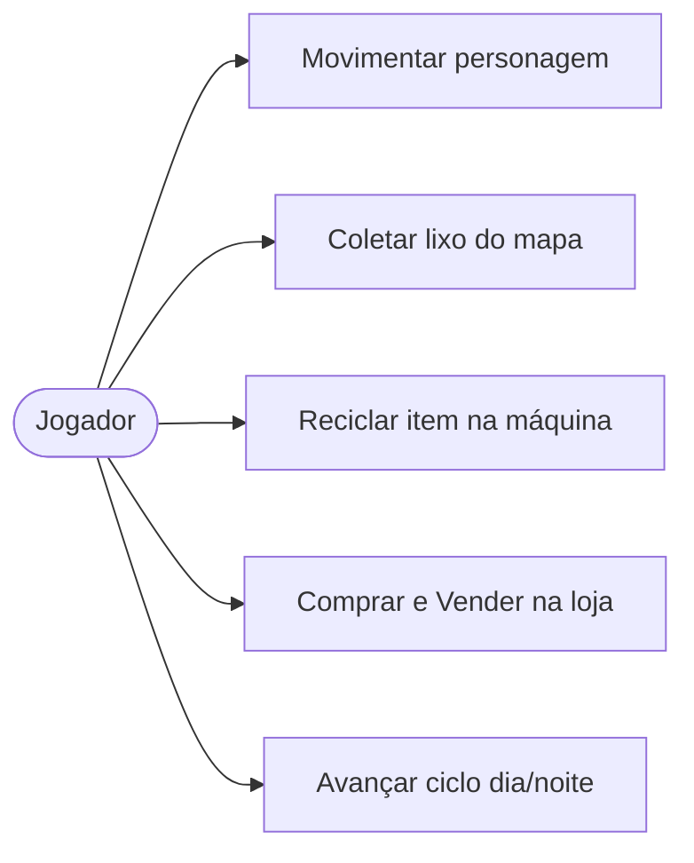

### 4.2 Realizações de Casos de Uso Significativas

#### UC2 — Coletar Lixo do Mapa

Este caso de uso exercita quatro padrões GoF simultaneamente: Object Pool, Observer, Facade e Singleton.

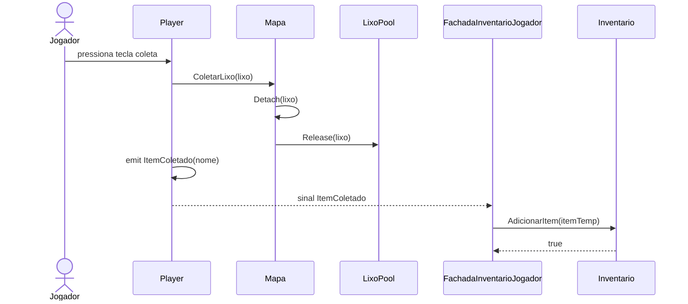

#### UC3 — Reciclar Item

Exercita Builder e Strategy:

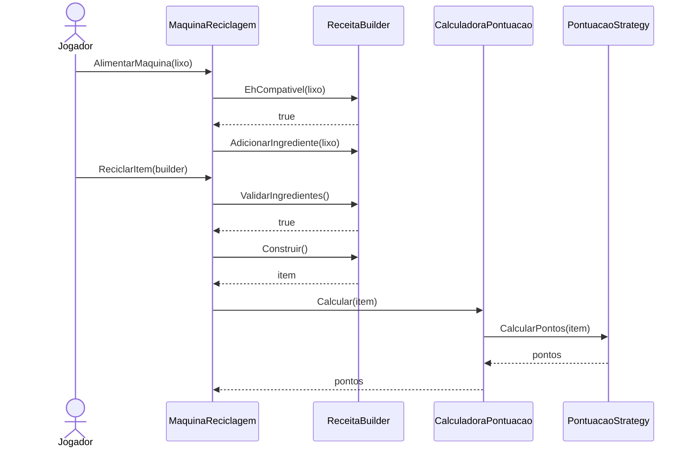

---

## 5. Visão Lógica

### 5.1 Visão Geral — Diagrama de Pacotes MVC

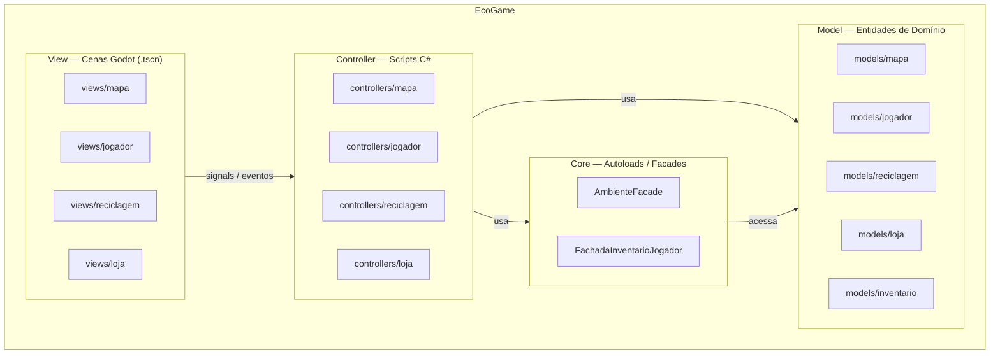

### 5.2 Pacotes Arquiteturalmente Significativos

#### 5.2.1 Frente D — Mapa e Ambiente

**`Mapa`** — Subject no padrão Observer e cliente do `LixoPool`. Atributos: `_observadores: List<ISunObserver>`, `_diaAtual: int`, `_pool: LixoPool`. Responsabilidades: registrar/remover observadores, notificar ciclo dia/noite, gerenciar spawn e coleta de lixo via Object Pool.

**`AmbienteFacade`** — Facade (GoF Estrutural). Expõe operações de alto nível sobre três subsistemas:

| Subsistema | Responsabilidade |
|---|---|
| `IluminacaoSubsystem` | Controla intensidade da luz |
| `CicloDiaNoiteSubsystem` | Gerencia fase atual (Dia/Noite) |
| `ClimaSubsystem` | Define condição climática |

**`LixoPool`** — Object Pool (GoF Criacional). Instâncias pré-alocadas de `Lixo` para evitar pressão no GC. Limites: inicial=16, máximo=128.

**`ISunObserver`** — Interface do Observer. Contrato: `OnSunrise()` e `OnSunset()`.

#### 5.2.2 Frente B — Jogador e Inventário

**`Player`** — Singleton (GoF Criacional) via `GetInstancia()`. Gerencia movimento, animações e estado do jogador. Emite sinal `ItemColetado`.

**`FachadaInventarioJogador`** — Facade (GoF Estrutural). Ponto único de acesso ao conjunto Player + Inventário.

**`SlotInventario`** — Composite (GoF Estrutural). Agrega itens do mesmo tipo com limite de stack de 12.

#### 5.2.3 Frente A — Reciclagem

**`MaquinaReciclagem`** — Orquestra Builder e Strategy.

**`ReceitaBuilder`** — Interface do Builder (GoF Criacional). Implementações: `BaldeBuilder`, `MetalBuilder`, `PlasticoBuilder`, `VidroBuilder`, `OrganicoBuilder`, `EnxadaBuilder`, `FoiceBuilder`, `MachadoBuilder`, `PicaretaBuilder`, `RegadorBuilder`.

**`PontuacaoStrategy`** — Interface do Strategy (GoF Comportamental). Implementações: `PontuacaoBaseStrategy`, `PontuacaoRaridadeStrategy`, `PontuacaoComboStrategy`.

**`BaldeComposite`** — Composite (GoF Estrutural). Container de itens que se comporta como um item.

#### 5.2.4 Frente C — Loja

**`LojaAbstrata`** — Template Method (GoF Comportamental). Define o esqueleto de `templateComprarItem` e `templateVenderItem` com hooks sobrescritos pelas subclasses.

**`FLoja<T>`** — Factory Method (GoF Criacional). `FLojaFerramentas` e `FLojaSementes` são ConcreteCreators.

**`VerificadorCompra`** — Proxy (GoF Estrutural). Intercepta operações de compra/venda com suporte a hot swap de loja alvo.

### 5.3 Diagrama de Classes — Subsistema Mapa

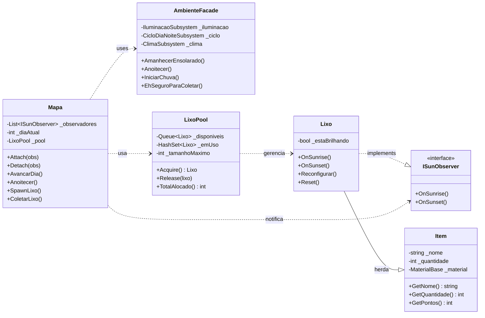

### 5.4 Diagrama de Classes — Subsistema Jogador e Inventário

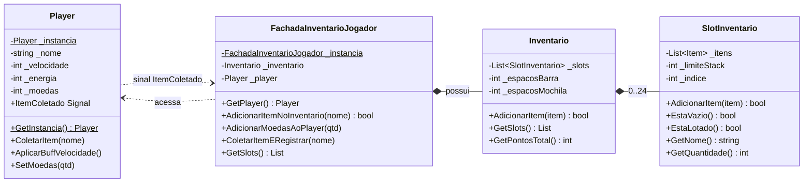

### 5.5 Diagrama de Classes — Subsistema Reciclagem

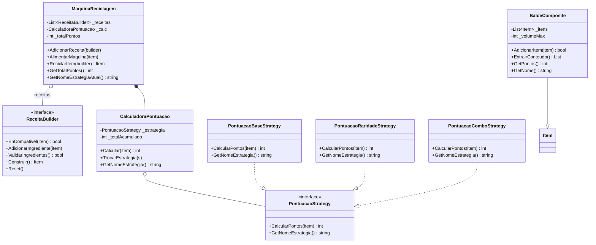

### 5.6 Diagrama de Classes — Subsistema Loja

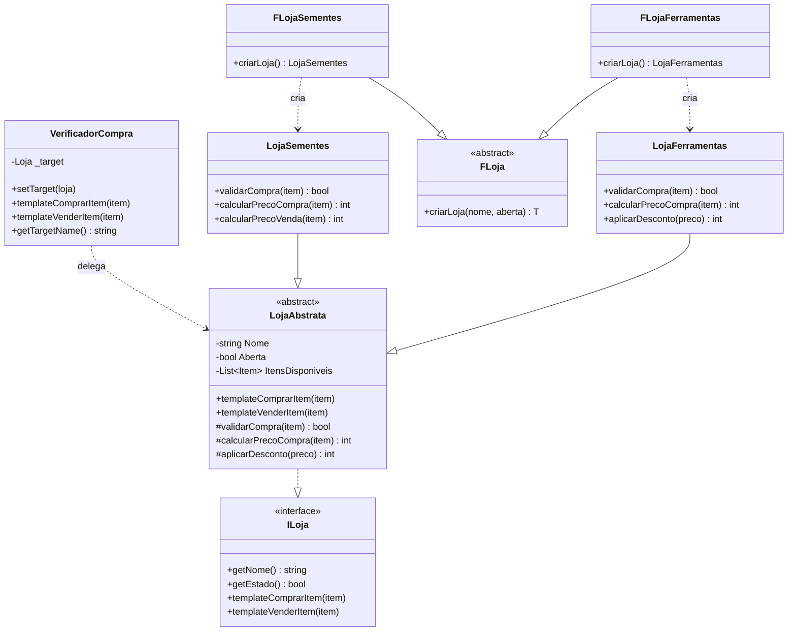

### 5.7 Rastreabilidade GoF ↔ Código

| Padrão GoF | Tipo | Frente | Arquivo(s) |
|---|---|---|---|
| Object Pool | Criacional | D | `LixoPool.cs` |
| Observer | Comportamental | D | `Mapa.cs`, `ISunObserver.cs`, `Lixo.cs` |
| Facade | Estrutural | D | `AmbienteFacade.cs` |
| Singleton | Criacional | B | `Player.cs` |
| Facade | Estrutural | B | `FachadaInventarioJogador.cs` |
| Composite | Estrutural | B | `SlotInventario.cs` |
| Builder | Criacional | A | `ReceitaBuilder.cs`, `*Builder.cs` |
| Strategy | Comportamental | A | `PontuacaoStrategy.cs`, `CalculadoraPontuacao.cs` |
| Composite | Estrutural | A | `BaldeComposite.cs` |
| Factory Method | Criacional | C | `FLoja.cs`, `FLojaFerramentas.cs`, `FLojaSementes.cs` |
| Template Method | Comportamental | C | `Loja.cs` (LojaAbstrata) |
| Proxy | Estrutural | C | `VerificadorCompra.cs` |

---

## 6. Visão de Processos

O EcoGame é **single-threaded**, gerenciado pelo loop de cena do Godot. Não há multi-threading explícito.

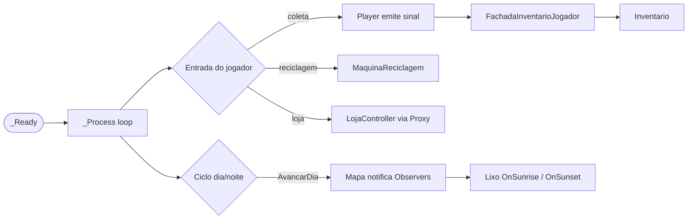

A comunicação entre nós ocorre via **sinais** do Godot (Observer nativo), desacoplando emissor e receptor.

---

## 7. Visão de Implantação

O EcoGame é stand-alone — sem servidor, banco de dados ou rede em tempo de execução.

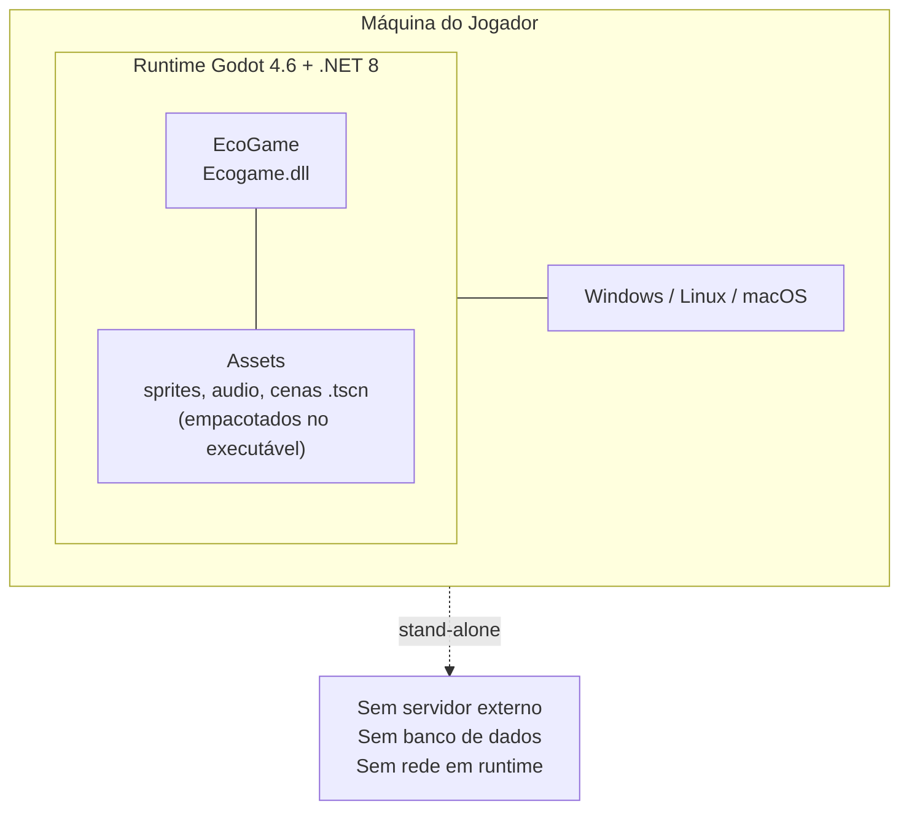

O binário exportado é autocontido — todos os assets são empacotados pelo Godot no executável final.

---

## 8. Visão de Implementação

### 8.1 Diagrama de Componentes

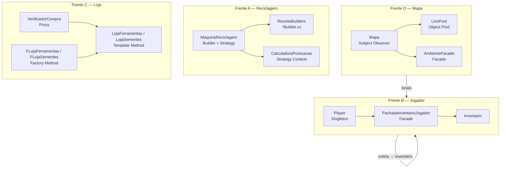

### 8.2 Organização Física — Camadas

```
src/ecogame/
├── models/
│   ├── Item.cs, MaterialBase.cs
│   ├── mapa/          ← Mapa.cs, Lixo.cs, LixoPool.cs, Semente.cs, ISunObserver.cs
│   ├── jogador/       ← Player.cs, CafeItem.cs
│   ├── inventario/    ← Inventario.cs, SlotInventario.cs
│   ├── reciclagem/    ← BaldeComposite.cs, Ferramenta.cs, Reciclado.cs
│   └── loja/          ← Loja.cs (ILoja + LojaAbstrata + concretas + factories)
├── views/
│   ├── mapa/          ← MapaView.cs
│   ├── jogador/       ← InventarioView.cs
│   ├── reciclagem/    ← ReciclagemView.cs
│   └── loja/          ← LojaView.cs
├── controllers/
│   ├── mapa/          ← MapaController.cs
│   ├── jogador/       ← JogadorController.cs
│   ├── inventario/    ← InventarioController.cs
│   ├── reciclagem/    ← ReciclagemController.cs + Builder/* + Strategy/*
│   └── loja/          ← LojaController.cs + FLojas + VerificadorCompra
├── core/
│   └── autoloads/     ← AmbienteFacade.cs, FachadaInventarioJogador.cs + subsystems
├── scenes/
│   ├── mapa/          ← DemoFrenteD.cs + DemoFrenteD.tscn
│   ├── loja/          ← DemoFrenteC.cs + DemoFrenteC.tscn
│   ├── reciclagem/    ← TesteBuilder.tscn
│   └── testes/        ← SalaTesteMovimento.cs + .tscn
└── assets/
    ├── sprites/       ← farmerM_*.png, café.png
    └── testes/        ← TesteBuilder.cs, TesteComposite.cs, TesteStrategy.cs
```

### 8.3 Alocação das Classes nas Camadas MVC

| Classe | Camada | Justificativa |
|---|---|---|
| `Item`, `Lixo`, `Semente`, `Ferramenta`, `Reciclado` | Model | Entidades de domínio puras, sem lógica de UI |
| `Inventario`, `SlotInventario` | Model | Estado de dados do jogador |
| `LixoPool` | Model | Gerencia estado de instâncias reutilizáveis |
| `PontuacaoStrategy` e implementações | Model | Regras de negócio isoladas de UI |
| `Mapa` | Model/Controller | Mantém estado do mundo e coordena objetos |
| `Player` | Model/Controller | Estado + processamento de input |
| `AmbienteFacade`, `FachadaInventarioJogador` | Controller | Coordenam subsistemas e expõem API simplificada |
| `MaquinaReciclagem`, `LojaController` | Controller | Orquestram padrões sem lógica de UI |
| Cenas `.tscn` + sprites | View | Representação visual gerenciada pelo Godot |

---

## 9. Visão de Dados

O EcoGame **não possui persistência de dados** entre sessões — decisão tomada na reunião de 09/06/2026.

Todo o estado é mantido em memória durante a execução:

- `Inventario` — `List<SlotInventario>` na heap do .NET
- `MaquinaReciclagem` — pontuação e itens em `List<>` e `int`
- `LixoPool` — instâncias em `Queue<Lixo>` e `HashSet<Lixo>`

**Implicação arquitetural**: a separação MVC facilita adicionar persistência futuramente — bastaria um `SaveManager` (Model) que serializa os estados para JSON, sem alterar Controllers ou Views.

---

## 10. Tamanho e Desempenho

| Dimensão | Valor / Decisão |
|---|---|
| Instâncias `Lixo` simultâneas | Até 128 (limitado pelo `LixoPool`) |
| Slots de inventário | 24 (8 barra + 16 mochila) |
| Tamanho de stack por slot | 12 itens do mesmo tipo |
| Loop Observer | O(n) onde n = observadores registrados |
| Estratégias de pontuação | 3 estratégias trocadas dinamicamente por limiar de XP |
| Target de FPS | 60 FPS (padrão Godot) |

**Decisão crítica de desempenho**: o `LixoPool` evita alocações repetidas de `Lixo` durante o ciclo dia/noite, reduzindo pressão no GC do .NET e eliminando stutters que ocorreriam com `new Lixo()` a cada spawn.

---

## 11. Qualidade

### 11.1 Extensibilidade

O sistema foi projetado para crescer sem modificar código existente (Open/Closed Principle):

- **Novo tipo de item**: criar subclasse de `Item` — sem alterar `Inventario` ou `MaquinaReciclagem`.
- **Nova receita**: implementar `ReceitaBuilder` e registrar na `MaquinaReciclagem`.
- **Novo tipo de loja**: herdar de `LojaAbstrata` e criar `FLoja<T>` correspondente.
- **Nova estratégia de pontuação**: implementar `PontuacaoStrategy`.

### 11.2 Manutenibilidade

A separação MVC garante que alterações visuais (cenas `.tscn`, sprites) não afetam a lógica de negócio, e vice-versa. As Facades (`AmbienteFacade`, `FachadaInventarioJogador`) reduzem o acoplamento entre frentes.

### 11.3 Testabilidade

Os Models são POCOs e podem ser testados sem o runtime do Godot. São completamente testáveis com xUnit ou NUnit: `MaquinaReciclagem`, `Inventario`, `LixoPool` e todas as implementações de `PontuacaoStrategy`.

### 11.4 Limitações Conhecidas (Dívida Técnica)

- O **Singleton em `Player`** cria acoplamento global. Recomenda-se substituir por Autoload do Godot em versões futuras.
- A **ausência de persistência** limita a experiência do jogador — a arquitetura MVC facilita adicionar essa camada futuramente sem refatoração ampla.
- A **UI da Loja** (tela interativa de compra/venda) está pendente; o código de negócio está integrado e funcional.

---

## Referências

- MILENE SERRANO. *Arquitetura e Desenho de Software — Aula Arquitetura & DAS – Parte II*. UnB Gama, 2025.
- RUP. *Software Architecture Document Template*. Rational Software Corporation, 2001. Disponível em: http://www.funpar.ufpr.br:8080/rup
- GAMMA, E. et al. *Design Patterns: Elements of Reusable Object-Oriented Software*. Addison-Wesley, 1994.
- Godot Engine Documentation. *C# Signals and Autoloads*. Disponível em: https://docs.godotengine.org
- Ata de Reunião 01/06/2026 — Definição das frentes e padrões GoF.
- Ata de Reunião 09/06/2026 — Decisão arquitetural: sem banco de dados.

