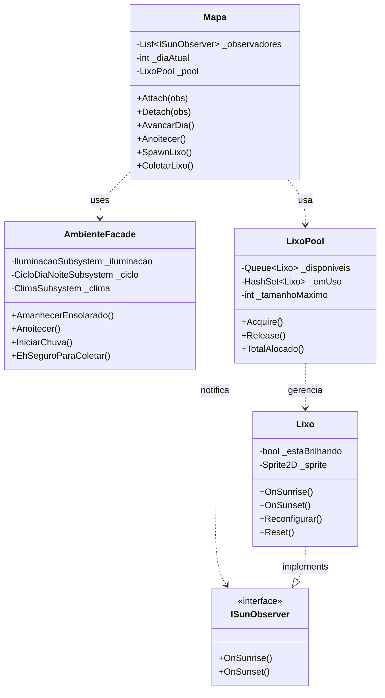
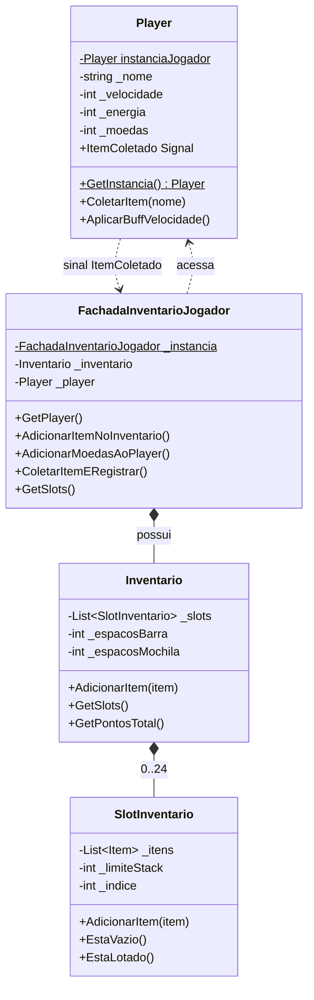

# 4.1. Documento de Arquitetura de Software (DAS) — EcoGame

## Histórico de Versões

| Versão | Data       | Descrição                                          | Autor(es)                    |
|--------|------------|----------------------------------------------------|------------------------------|
| 1.0    | 14/06/2026 | Criação do documento — Visão Lógica e Implementação | João Pedro Araújo de Freitas Lyra |

---

## 1. Introdução

### 1.1 Finalidade

Este documento descreve a arquitetura de software do **EcoGame**, um jogo 2D educativo desenvolvido em Godot (C#). Seu objetivo é registrar as decisões arquiteturais que guiam o desenvolvimento, apresentar as visões arquiteturais escolhidas e evidenciar a rastreabilidade entre o design e o código implementado.

### 1.2 Escopo

O EcoGame é um jogo **stand-alone** com quatro frentes de desenvolvimento independentes (Mapa/Ambiente, Jogador/Inventário, Reciclagem e Loja), integradas por um padrão arquitetural **MVC (Model-View-Controller)**. O documento cobre as visões **Lógica** e **de Implementação**, conforme exigência mínima da entrega.

### 1.3 Visões Apresentadas

De acordo com o modelo de visões 4+1 do RUP, este documento apresenta:

- **Visão Lógica** — organização conceitual em pacotes/camadas MVC, classes principais e seus relacionamentos.
- **Visão de Implementação** — organização física dos módulos em componentes e a alocação das classes nas camadas MVC.

---

## 2. Representação Arquitetural

### 2.1 Estilo Arquitetural: Stand-alone + MVC

O EcoGame adota dois estilos combinados:

**Stand-alone**: o jogo roda inteiramente na máquina do jogador, sem dependência de servidor externo, banco de dados ou conexão de rede em tempo de jogo. Todo o estado é gerenciado em memória durante a sessão.

**MVC (Model-View-Controller)**: as responsabilidades do sistema são separadas em três camadas:

| Camada | Responsabilidade no EcoGame | Localização no repositório |
|--------|----------------------------|---------------------------|
| **Model** | Entidades de domínio: `Item`, `Lixo`, `Semente`, `Inventario`, `Mapa`, dados do `Player` | `src/ecogame/models/` |
| **View** | Cenas Godot (`.tscn`), sprites e animações exibidas ao jogador | `src/ecogame/views/` + `assets/` |
| **Controller** | Scripts C# que processam entrada do jogador, coordenam modelos e atualizam a view | `src/ecogame/controllers/` |

**Justificativa**: O MVC foi escolhido por ser nativo ao fluxo do Godot (nós de cena ↔ scripts ↔ sinais), por facilitar a divisão de trabalho entre as quatro frentes sem dependências cruzadas, e por tornar testável a lógica de negócio (Model) independentemente da engine.

---

## 3. Visão Lógica

A Visão Lógica organiza o software em termos de pacotes, subsistemas e classes arquiteturalmente relevantes, evidenciando as camadas do MVC e os principais padrões GoF aplicados.

### 3.1 Diagrama de Pacotes — Camadas MVC

```
┌─────────────────────────────────────────────────────────┐
│                   «package» EcoGame                     │
│                                                         │
│  ┌──────────────────────────────────────────────────┐   │
│  │              View (Cenas Godot)                  │   │
│  │  views/mapa/  views/jogador/  views/reciclagem/  │   │
│  │              views/loja/                         │   │
│  └──────────────────────┬───────────────────────────┘   │
│                         │ «use» (signals/eventos)        │
│  ┌──────────────────────▼───────────────────────────┐   │
│  │            Controller (Scripts C#)               │   │
│  │  controllers/mapa/    controllers/jogador/       │   │
│  │  controllers/reciclagem/  controllers/loja/      │   │
│  │  controllers/inventario/                         │   │
│  └──────────────────────┬───────────────────────────┘   │
│                         │ «use»                          │
│  ┌──────────────────────▼───────────────────────────┐   │
│  │               Model (Entidades)                  │   │
│  │  models/mapa/     models/jogador/                │   │
│  │  models/reciclagem/   models/inventario/         │   │
│  │  models/loja/                                    │   │
│  └──────────────────────────────────────────────────┘   │
│                                                         │
│  ┌──────────────────────────────────────────────────┐   │
│  │           core/ (Autoloads / Facades)            │   │
│  │   AmbienteFacade   FachadaInventarioJogador      │   │
│  └──────────────────────────────────────────────────┘   │
└─────────────────────────────────────────────────────────┘
```

> A camada `core/` concentra as Facades e Autoloads do Godot, que atuam como ponto de entrada global acessível por qualquer outra camada, sem violar a separação MVC.

### 3.2 Classes Arquiteturalmente Significativas

#### 3.2.1 Frente D — Mapa e Ambiente

**`Mapa`** — Controller/Model híbrido. Atua como **Subject** no padrão Observer e como **cliente** do `LixoPool`. É o núcleo da cena principal do jogo.

Atributos relevantes: `_observadores: List<ISunObserver>`, `_diaAtual: int`, `_pool: LixoPool`

Responsabilidades:
- Registrar/remover observadores (`Attach`/`Detach`)
- Notificar o ciclo dia/noite (`AvancarDia`, `Anoitecer`)
- Gerenciar spawn e coleta de lixo via Object Pool

**`AmbienteFacade`** — Implementa o padrão **Facade** (GoF Estrutural). Expõe operações de alto nível (`AmanhecerEnsolarado`, `Anoitecer`, `IniciarChuva`) sobre três subsistemas internos.

| Subsistema | Responsabilidade |
|---|---|
| `IluminacaoSubsystem` | Controla a intensidade da luz na cena |
| `CicloDiaNoiteSubsystem` | Gerencia a fase atual (Dia/Noite) |
| `ClimaSubsystem` | Define a condição climática (Ensolarado/Nublado/Chuva) |

**`LixoPool`** — Implementa o padrão **Object Pool** (GoF Criacional). Mantém um conjunto pré-alocado de instâncias `Lixo` para evitar pressão no GC do .NET durante o ciclo dia/noite. Limites: inicial=16, máximo=128 instâncias.

**`ISunObserver`** — Interface do padrão Observer. Contrato: `OnSunrise()` e `OnSunset()`. Implementado por `Lixo` e qualquer entidade que reaja ao ciclo solar.

#### 3.2.2 Frente B — Jogador e Inventário

**`Player`** — Model/Controller do jogador. Implementa o padrão **Singleton** (GoF Criacional) via `instanciaJogador` e `GetInstancia()`. Gerencia movimento (WASD), animações direcionais e estado do jogador (energia, moedas). Emite o sinal `ItemColetado` (padrão Observer nativo do Godot).

**`FachadaInventarioJogador`** — Implementa o padrão **Facade** (GoF Estrutural). Ponto único de acesso ao conjunto Player + Inventário. Conecta-se ao sinal `ItemColetado` do `Player` para adicionar itens automaticamente ao `Inventario`.

**`Inventario`** — Model. Gerencia os `SlotInventario[]` do jogador.

#### 3.2.3 Frente A — Reciclagem

**`MaquinaReciclagem`** — Controller da reciclagem. Orquestra dois padrões:
- **Builder** (GoF Criacional): via `ReceitaBuilder` e suas especializações (`BaldeBuilder`, `FoiceBuilder`, `MachadoBuilder`, `EnxadaBuilder`, etc.), que constroem itens transformados a partir de ingredientes.
- **Strategy** (GoF Comportamental): via `CalculadoraPontuacao` (contexto) e `PontuacaoStrategy` (interface), com implementações `PontuacaoBaseStrategy`, `PontuacaoRaridadeStrategy` e `PontuacaoComboStrategy`.

**`PontuacaoStrategy`** — Interface do padrão Strategy. Contrato: `CalcularPontos(Item item)` e `GetNomeEstrategia()`.

### 3.3 Diagrama de Classes — Subsistema Mapa (Padrões Centrais)



### 3.4 Diagrama de Classes — Subsistema Jogador



### 3.5 Rastreabilidade com Artefatos Anteriores

| Decisão Arquitetural | Padrão GoF | Frente | Artefato de Código |
|---|---|---|---|
| Desacoplamento do ambiente em subsistemas | Facade (Estrutural) | D | `AmbienteFacade.cs` |
| Notificação do ciclo dia/noite a entidades | Observer (Comportamental) | D | `Mapa.cs`, `ISunObserver.cs` |
| Gerenciamento de instâncias de lixo | Object Pool (Criacional) | D | `LixoPool.cs` |
| Acesso global único ao jogador | Singleton (Criacional) | B | `Player.cs` |
| Ponto único Jogador ↔ Inventário | Facade (Estrutural) | B | `FachadaInventarioJogador.cs` |
| Construção de ferramentas recicladas | Builder (Criacional) | A | `ReceitaBuilder.cs`, `*Builder.cs` |
| Cálculo flexível de pontuação | Strategy (Comportamental) | A | `PontuacaoStrategy.cs`, `Calculadora*.cs` |

---

## 4. Visão de Implementação

A Visão de Implementação mapeia os elementos lógicos para a organização física dos módulos no repositório e evidencia como os componentes se conectam.

### 4.1 Diagrama de Componentes — EcoGame

```
┌──────────────────────────────────────────────────────────────┐
│                    «subsystem» EcoGame                        │
│                                                              │
│  ┌─────────────────┐       ┌──────────────────────────────┐  │
│  │ «component»     │       │ «component»                  │  │
│  │  Mapa           │──────▶│  AmbienteFacade              │  │
│  │  (Frente D)     │       │  (IluminacaoSubsystem +      │  │
│  └────────┬────────┘       │   CicloDiaNoiteSubsystem +   │  │
│           │                │   ClimaSubsystem)            │  │
│           │ «uses»         └──────────────────────────────┘  │
│           ▼                                                  │
│  ┌─────────────────┐                                         │
│  │ «component»     │                                         │
│  │  LixoPool       │                                         │
│  └─────────────────┘                                         │
│                                                              │
│  ┌─────────────────┐       ┌──────────────────────────────┐  │
│  │ «component»     │──────▶│ «component»                  │  │
│  │  Player         │       │  FachadaInventarioJogador    │  │
│  │  (Frente B)     │       │  (Inventario + Player)       │  │
│  └─────────────────┘       └──────────────────────────────┘  │
│                                                              │
│  ┌─────────────────┐       ┌──────────────────────────────┐  │
│  │ «component»     │──────▶│ «component»                  │  │
│  │  MaquinaRecicla-│       │  CalculadoraPontuacao        │  │
│  │  gem (Frente A) │       │  (Strategy Context)          │  │
│  └────────┬────────┘       └──────────────────────────────┘  │
│           │ «uses»                                            │
│           ▼                                                  │
│  ┌─────────────────┐                                         │
│  │ «component»     │                                         │
│  │  ReceitaBuilders│                                         │
│  │  (*Builder.cs)  │                                         │
│  └─────────────────┘                                         │
└──────────────────────────────────────────────────────────────┘
```

### 4.2 Organização Física no Repositório

```
src/ecogame/
├── models/
│   ├── mapa/          ← Mapa.cs, Lixo.cs, Item.cs, Semente.cs
│   ├── jogador/       ← Player.cs (atributos de estado)
│   ├── inventario/    ← Inventario.cs, SlotInventario.cs
│   ├── reciclagem/    ← MaquinaReciclagem.cs, ReceitaBuilder.cs
│   └── loja/
├── views/
│   ├── mapa/          ← cenas .tscn do mapa
│   ├── jogador/       ← cenas do jogador
│   ├── reciclagem/    ← cenas da máquina
│   └── loja/
├── controllers/
│   ├── mapa/          ← scripts que processam input do mapa
│   ├── jogador/       ← FachadaInventarioJogador.cs
│   ├── reciclagem/    ← lógica de interação com MaquinaReciclagem
│   └── loja/
├── core/
│   └── autoloads/     ← AmbienteFacade.cs, FachadaInventarioJogador.cs
└── assets/
    ├── sprites/       ← farmerM_*.png, café.png
    ├── audio/
    └── textures/
```

### 4.3 Alocação das Classes nas Camadas MVC

| Classe | Camada MVC | Justificativa |
|---|---|---|
| `Item`, `Lixo`, `Semente`, `Ferramenta`, `Reciclado` | **Model** | Entidades de domínio puras, sem lógica de UI |
| `Inventario`, `SlotInventario` | **Model** | Estado de dados do jogador |
| `Mapa` | **Model/Controller** | Mantém estado do mundo e coordena objetos |
| `Player` | **Model/Controller** | Estado (energia, moedas) + processamento de input |
| `AmbienteFacade`, `FachadaInventarioJogador` | **Controller** | Coordenam subsistemas e expõem API simplificada |
| `MaquinaReciclagem` | **Controller** | Orquestra Builder + Strategy sem lógica de UI |
| `LixoPool` | **Model** | Gerencia estado de instâncias reutilizáveis |
| `PontuacaoStrategy` e implementações | **Model** | Regras de negócio isoladas de UI e controllers |
| Cenas `.tscn` + sprites | **View** | Representação visual gerenciada pelo Godot |

---

## 5. Senso Crítico

### 5.1 Pontos Positivos

- A combinação **Stand-alone + MVC** se alinha bem ao modelo de nós do Godot: cenas são Views naturais, scripts C# são Controllers e as classes de domínio são Models isoláveis.
- O uso de **Facades** (`AmbienteFacade`, `FachadaInventarioJogador`) simplificou o acesso cross-frente sem criar dependências diretas entre classes internas.
- O **Object Pool** em `LixoPool` é tecnicamente justificado para um jogo: evita GC stutter em runtime no .NET/Godot ao reutilizar centenas de instâncias `Lixo` durante o ciclo dia/noite.

### 5.2 Limitações e Dívidas Técnicas

- A **ausência de um banco de dados** (decidida na reunião de 09/06) significa que o progresso do jogador não persiste entre sessões. Caso necessário no futuro, a separação MVC facilita adicionar uma camada de persistência (ex.: `SaveManager` como Model, lendo/escrevendo JSON) sem refatorar Controllers ou Views.
- O **Singleton em `Player`** é conveniente, mas cria acoplamento global. Em versões futuras, recomenda-se substituir por um Autoload do Godot ou injeção via `FachadaInventarioJogador`, que já centraliza o acesso.
- A Frente C (Loja) ainda não possui código implementado no repositório; sua integração na Fase 2 (conforme issue de integração) pode introduir conflitos na camada de inventário compartilhada com a Frente B.

---

## 6. Referências

- MILENE SERRANO. *Arquitetura e Desenho de Software — Aula Arquitetura & DAS – Parte II*. UnB Gama, 2025.
- RUP. *Rational Unified Process — Logical View*. Disponível em: http://www.funpar.ufpr.br:8080/rup/process/workflow/ana_desi/co_lview.htm
- GAMMA, E. et al. *Design Patterns: Elements of Reusable Object-Oriented Software*. Addison-Wesley, 1994.
- Godot Engine Documentation. *C# Signals*. Disponível em: https://docs.godotengine.org
